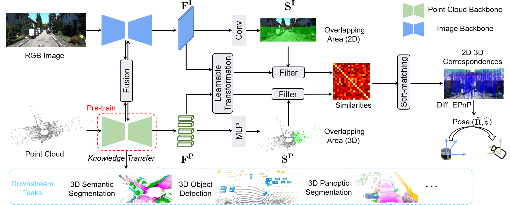

# Self-supervised Learning of LiDAR 3D PointClouds via 2D-3D Neural Calibration

Official Pytorch implementation of the method **NCLR**. More details can be found in the paper:

**Self-supervised Learning of LiDAR 3D PointClouds via 2D-3D Neural Calibration**, Arxiv 2024 [[arXiv](https://arxiv.org/abs/2401.12452)]
by *Yifan Zhang, Siyu Ren, Junhui Hou, Jinjian Wu, Yixuan Yuan, Guangming Shi*



If you use NCLR in your research, please cite:
```
@article{zhang2024nclr,
  title={Self-supervised Learning of LiDAR 3D Point Clouds via 2D-3D Neural Calibration},
  author={Zhang, Yifan and Ren, Siyu and Hou, Junhui and Wu, Jinjian and Yuan, Yixuan and Shi, Guangming},
  journal={arXiv preprint arXiv:2401.12452},
  year={2024}
}
```

## Dependencies

To install the various dependencies, you can run ```pip install -r requirements.txt```.


## Datasets

The code provided can be used with [nuScenes](https://www.nuscenes.org/lidar-segmentation), [SemanticKITTI](http://www.semantic-kitti.org/tasks.html#semseg), and [SemanticPOSS](http://www.poss.pku.edu.cn/semanticposs.html). Put the datasets you intend to use in the datasets folder (a symbolic link is accepted).

## Pre-trained models

### Minkowski SR-UNet
[SR-UNet pre-trained on nuScenes](todo)

[SR-UNet pre-trained on SemanticKITTI](todo)

### SPconv VoxelNet
[VoxelNet pre-trained on nuScenes](todo)

## Reproducing the results

*When using MinkowskiEngine (on SemanticKITTI), please set the OMP_NUM_THREADS environment variable to your number of CPU cores*

### Semantic segmentation's pre-training

Config file for SemanticKITTI is included for [MinkowskiEngine](https://github.com/NVIDIA/MinkowskiEngine) by default to keep retro-compatibility with previous work, while for nuScenes it uses [Torchsparse](https://github.com/mit-han-lab/torchsparse) which is generally faster. Switching between libraries in the config files is easy. While architectures are similar, weights from one library cannot easily be transferred to the other.

- On nuScenes:

```python train.py --config_file cfgs/pretrain_ns_minkunet.yaml --name minkunet_nclr_ns```

- On SemanticKITTI:

```python train.py --config_file cfgs/pretrain_sk_minkunet.yaml --name minkunet_nclr_sk```

### Semantic segmentation's downstream

The specific code for downstream semantic segmentation has been adapted from [ALSO](https://github.com/valeoai/ALSO).

#### Results on nuScenes' validation set using a Minkowski SR-Unet 34:
Method                                            | 0.1%   | 1%     | 10%    | 50%    | 100%
---                                               |:-:     |:-:     |:-:     |:-:     |:-:
Random init.                                      | 21.6   | 35.0   | 57.3   | 69.0   | 71.2
[PointContrast](https://arxiv.org/abs/2007.10985) | 27.1 | 37.0   | 58.9   | 69.4   | 71.1
[DepthContrast](https://arxiv.org/abs/2101.02691) | 21.7   | 34.6   | 57.4   | 69.2   | 71.2
[ALSO](https://arxiv.org/abs/2104.04687)          | 26.2   | 37.4   | 59.0 | 69.8   | 71.8
NCLR                                              | **26.6** |**37.8**|**59.5**|**71.2**|**72.7**

To launch a downstream experiment, with a Torchsparse SR-Unet, you can use these commands in addition with `cfg.downstream.checkpoint_dir=[checkpoint directory] cfg.downstream.checkpoint_name=[checkpoint name]`

```bash
cd downstream

# 100%
python train_downstream_semseg.py cfg=nuscenes_torchsparse cfg.downstream.max_epochs=30 cfg.downstream.val_interval=5 cfg.downstream.skip_ratio=1

# 50%
python train_downstream_semseg.py cfg=nuscenes_torchsparse cfg.downstream.max_epochs=50 cfg.downstream.val_interval=5 cfg.downstream.skip_ratio=2

# 10%
python train_downstream_semseg.py cfg=nuscenes_torchsparse cfg.downstream.max_epochs=100 cfg.downstream.val_interval=10 cfg.downstream.skip_ratio=10

# 1%
python train_downstream_semseg.py cfg=nuscenes_torchsparse cfg.downstream.max_epochs=500 cfg.downstream.val_interval=50 cfg.downstream.skip_ratio=100

# 0.1%
python train_downstream_semseg.py cfg=nuscenes_torchsparse cfg.downstream.max_epochs=1000 cfg.downstream.val_interval=100 cfg.downstream.skip_ratio=1000
```


<!-- #### Results on SemanticKITTI' validation set using a Minkowski SR-Unet 18:
Method                                                               | 0.1%   | 1%     | 10%    | 50%    | 100%
---                                                                  |:-:     |:-:     |:-:     |:-:     |:-:
Random init.                                                         | 30.0   | 46.2   | 57.6   | 61.8   | 62.7
[PointContrast](https://arxiv.org/abs/2007.10985)                    | 32.4   | 47.9   | 59.7   | 62.7   | 63.4
[SegContrast](http://www.ipb.uni-bonn.de/pdfs/nunes2022ral-icra.pdf) | 32.3   | 48.9   | 58.7   | 62.1   | 62.3
[DepthContrast](https://arxiv.org/abs/2101.02691)                    | 32.5   | 49.0   | 60.3   | 62.9   | 63.9
[STSSL](https://arxiv.org/abs/2303.16235)                            | 32.0   | 49.4   | 60.0   | 62.9   | 63.3
[ALSO](https://arxiv.org/abs/2104.04687)                             | 35.0   | 50.0   | 60.5   | 63.4 | 63.6
[TARL](http://www.ipb.uni-bonn.de/pdfs/nunes2023cvpr.pdf)            | 37.9   | 52.5   | 61.2   | 63.4 | 63.7
[NCLR](https://arxiv.org/abs/2401.12452)                  |**39.2**|**53.4**|**61.4**|**63.5**|**63.9** -->

To launch a downstream experiment, with a Minkowski SR-Unet, you can use these commands in addition with `cfg.downstream.checkpoint_dir=[checkpoint directory] cfg.downstream.checkpoint_name=[checkpoint name]`

```bash
cd downstream

# 100%
python train_downstream_semseg.py cfg=nuscenes_minkowski cfg.downstream.max_epochs=30 cfg.downstream.val_interval=5 cfg.downstream.skip_ratio=1

# 50%
python train_downstream_semseg.py cfg=nuscenes_minkowski cfg.downstream.max_epochs=50 cfg.downstream.val_interval=5 cfg.downstream.skip_ratio=2

# 10%
python train_downstream_semseg.py cfg=nuscenes_minkowski cfg.downstream.max_epochs=100 cfg.downstream.val_interval=10 cfg.downstream.skip_ratio=10

# 1%
python train_downstream_semseg.py cfg=nuscenes_minkowski cfg.downstream.max_epochs=500 cfg.downstream.val_interval=50 cfg.downstream.skip_ratio=100

# 0.1%
python train_downstream_semseg.py cfg=nuscenes_minkowski cfg.downstream.max_epochs=1000 cfg.downstream.val_interval=100 cfg.downstream.skip_ratio=1000
```

### Object detection's pre-training

```python train.py --config_file cfgs/pretrain_ns_spconv.yaml --name voxelnet_nclr_ns```

### Object detection's downstream

Please use the code of [OpenPCDet](https://github.com/open-mmlab/OpenPCDet) with default parameters for SECOND or PVRCNN and with no multiprocessing to retain compatibility with previous work and this one.

### Panoptic segmentation baseline
Panoptic segmentation baseline [MinkowskiPanoptic](https://github.com/PRBonn/MinkowskiPanoptic) implemented based on the MinkowskiEngine library

## Acknowledgment

Part of the codebase has been adapted from [OpenPCDet](https://github.com/open-mmlab/OpenPCDet), [ALSO](https://github.com/valeoai/ALSO), [valeoai](https://github.com/valeoai/BEVContrast), and [SLidR](https://github.com/valeoai/SLidR).

## TODO List

- [x] Initial release.
- [x] Add license. See [here](#license) for more details.
- [x] Add installation details.
- [x] Add data preparation details.
- [x] Add evaluation details.
- [x] Add training details.
- [ ] LTA
- [ ] Add pre-trained weights.

## Recommended Works
Here are some of the methods I recommend for 3D representation learning:
- SLidR: [Paper](https://arxiv.org/abs/2203.16258), [Code](https://github.com/valeoai/SLidR)
- OLIVINE: [Paper](arxiv.org/abs/2405.14271), [Code](https://github.com/Eaphan/OLIVINE)
- BEVContrast: [Paper](https://arxiv.org/abs/2310.17281), [Code](https://github.com/valeoai/BEVContrast)
- MinkowskiPanoptic: [Code](https://github.com/PRBonn/MinkowskiPanoptic)

## License
NCLR is released under the [Apache 2.0 license](./LICENSE).
